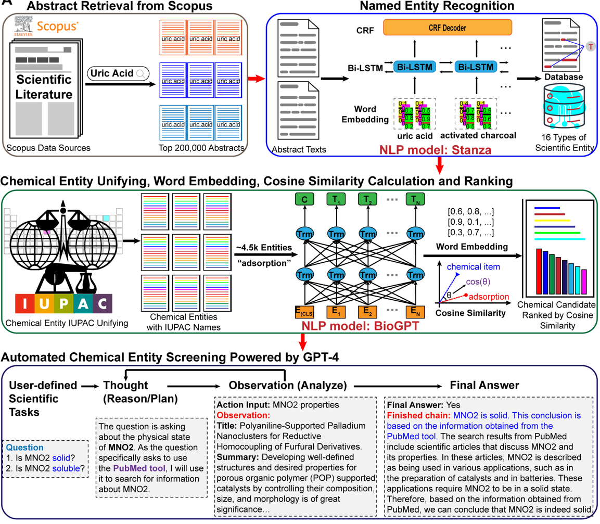

# MatWISE: a multi-tiered framework designed for material discovery

MatWISE, a multi-tiered framework designed to revolutionize the process of material discovery. Our mission is to help researchers and scientists navigate the vast ocean of scientific literature with ease and efficiency.

## Overview

MatWISE is a tool that leverages the power of state-of-the-art natural language processing, semantic relationship mapping, and machine learning to automate the complex process of material discovery.

Our objective is to assist chemists in simplifying the process of extracting valuable chemical entities from an overwhelming amount of scientific literature.

## How MatWISE works

<div align=center></div>


- **Step1. Named Entity Recognition**: The first step in the MatWISE involves the use of advanced Named Entity Recognition models. We utilize models such as [`Stanza`](https://stanfordnlp.github.io/stanza/biomed.html) to recognize and categorize entities in our large body of scientific literature. This allows us to extract material entities from the text and use it in the subsequent steps of the process.

- **Step2. Semantic Relationship Mapping**:
In the second step, we employ the [`PubChemPy`](https://pubchempy.readthedocs.io/en/latest/guide/introduction.html)tool to combine disparate names that reference the same chemical entity. This process involves documenting metadata such as the corresponding IUPAC (International Union of Pure and Applied Chemistry) nomenclature and Compound ID (CID) designation. This ensures that all information related to a specific chemical entity is unified and easily accessible.

- **Step3. Word Embedding & Caculate similarity**:
In the third step, we leverage the [`BioGPT-Large`](https://github.com/microsoft/BioGPT) model to provide valuable word embeddings. Then computing similarities to capture semantic relationships within a high-dimensional vector space. By doing so, we can understand and analyze the relationships between different chemical entities in a more nuanced and detailed manner.

- **Step4. Automated chemical entity screening powered by GPT-4**:
In the fourth step, we utilize a tool-enhanced [`GPT-4`](https://openai.com/gpt-4) model, which operates on the [`LangChain`](https://python.langchain.com/docs/get_started) framework and incorporates WebSearch tool and PubMedQuery tool. This advanced model allows us to automatically exclude materials with undesired physicochemical properties. By providing feedback on the physical and chemical characteristics of the materials, we can successfully filter out those that do not conform to our desired criteria. This ensures that only the most suitable materials are selected for further analysis and potential use.

## Getting Started

Note: We recommend deploying the MatWISE framework on a Linux-based system for optimal performance and compatibility. Detailed instructions will be provided in the subsequent sections.

## Installation
To run MatWISE, you can setup a conda environment.

Please note that all of our code has been tested on Linux system and in future versions, we will be adding support for Windows systems.

### Conda
Create the environment and install dependencies.
```
conda create -n MatWISE python=3.11.3
conda activate MatWISE
```
### Install the requirements
```
pip install -r requirements.txt
```
## Running a Sample_demo
### Step1. Named Entity Recognition:

If you are using MatWISE for the first time, you will need to download the necessary models for the NER.To download the English model with the 'BioNLP13CG' NER processor, run the following Python code:
```lang
stanza.download('en',package='mimic', processors={'ner': 'BioNLP13CG'})
```
Then you can run:
`Named_entity_Recognition.py`


### Step2. Semantic Relationship Mapping:
Run `Chemical_Entity_IUPAC_Unifying.py` to get IUPAC name and CID.

### Step3. Word Embedding & Caculate similarity:
Run `BioGPT.py` to get word embeddings and similarities.

### Step4. Automated chemical entity screening powered by GPT-4


---

You need to apply for [SERP_API_KEY](https://serpapi.com/) and [ OPENAI_API_KEY](https://openai.com/blog/gpt-4-api-general-availability)
. 
> **Note:**  We use GPT 4.0 in our experiment. *GPT-3.5* model may crash in this code, Based on our tests, the performance of *GPT-4* is far superior to *GPT-3.5*.

To quickly run the code, follow the steps below:

1. Import your OPENAI_API_KEY and SERP_API_KEY:

   ```
    vim ~/.bashrc

    #Openai_api_key
    export OPENAI_API_KEY="sk-xxxxx"

    #SERP_API
    export SERP_API_KEY="your own SERP_API_KEYxxxx"
   ```
> **Note:**[ More detail about SERP_API_KEY](https://serpapi.com/)

2. Run Automated_chemical_screening.py:

   ```
   cd  xx\MatWISE\
   nohup python Automated_chemical_screening.py >final_materials.txt
   ```


You should now be able to run the code successfully. 
If you encounter any issues, please refer to open an issue on the repository for further assistance.


## Data availability

The results of Named Entity Recognition using the Stanza model can be found at https://github.com/Junhang0202/MatWISE/blob/main/experiment_result/stanza_result_uric_acid.csv. 
The unification results for chemical entities utilizing PubChemPy can be accessed at https://github.com/Junhang0202/MatWISE/blob/main/experiment_result/SimpleChemical_stanza_result_Iupacname.csv. 
The BioGPT model's similarity calculation results are available at https://github.com/Junhang0202/MatWISE/blob/main/experiment_result/BioGPT_CosineSimilarity.csv. 
Additionally, the automated screening of chemical entities powered by GPT-4 has been recorded and can be found at https://github.com/Junhang0202/MatWISE/blob/main/experiment_result/finish_material_screening.csv and https://github.com/Junhang0202/MatWISE/blob/main/experiment_result/finish_material_screening.txt.
